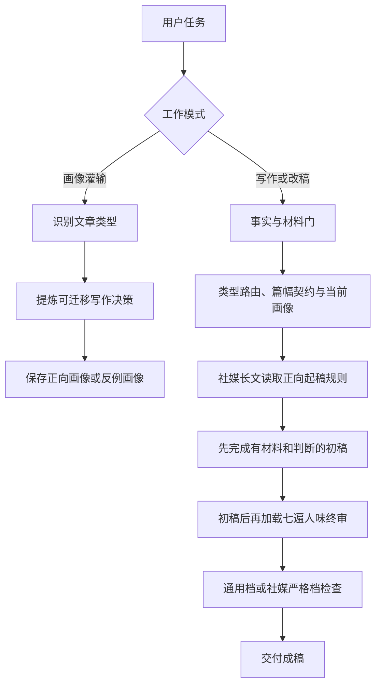

# human-doc-writing

[English](README_EN.md) | 简体中文

一个面向 Codex 的开源中文写作 Skill。它把渐进式个人写作画像、场景化文体路由和统一人味门禁放进同一套流程，覆盖公众号、小红书、知乎、博客、产品文档、教程、PRD、GitHub README 与发布说明。

它不会要求所有文章模仿同一种“活人感”。画像决定这次怎样写，统一门禁负责守住事实、材料、推进和自然中文的共同底线。

## 它解决什么问题

普通写作提示词经常在两个方向之间摇摆。

- 只强调个人风格，容易把假经历、重复解释和模型腔一起保存下来。
- 只强调统一去 AI 味，容易把公众号、PRD、README 和教程磨成同一种语气。

`human-doc-writing` 把这两层拆开处理。

1. 按读者任务识别文章类型。
2. 读取该类型当前的正向画像与反例画像。
3. 使用用户材料和项目事实写作。
4. 所有成稿统一经过事实与材料门、七遍终审和文体对应的检查器。

## 来源与引用

本项目融合并改编了 [KKKKhazix/human-writing](https://github.com/KKKKhazix/human-writing) 1.1.0 的方法，当前研究基线为提交 `4fda173f3fef7fb808f3eba991eeb2528ea4b189`。

吸收的部分包括事实与材料门、作者说话位置、段落推进、中文词序、七遍改稿、人味冷读和部分自动检查思路。上游采用 MIT License，本仓库在 [NOTICE.md](NOTICE.md) 与 [来源和许可证](human-doc-writing/references/human-writing-origin.md) 中保留了完整引用。

这不是卡兹克官方 Skill，也不要求模仿“数字生命卡兹克”的固定人设、口癖和尾部。本项目保留的是可迁移的写作方法，并在其外增加个人画像、类型路由、技术文档适配和长文编排。

## 效果与两次纠偏

融合过程曾使用三组相同材料做匿名评分，覆盖 GPT-5.6 长任务、UI Skills 总入口和个人写作系统三个议题。

| 历史版本 | 三篇平均分 |
|---|---:|
| 独立 `human-writing` | 91.3 |
| 第一版融合 | 88.3 |
| v1.0 融合版 | 93.3 |

发布后的逐段阅读发现，这组分数漏掉了一个重要问题。v1.0 融合版会在事实段之间加入自设问句、紧接着自答，也会插入孤立的“点题金句”和动作借喻。检查器虽然通过，读起来却比独立版刻意。独立版在前两篇里更自然，因为它直接描述事实、执行过程、原因和处理办法。

v1.1 据此把公众号默认写法重新对齐独立 `human-writing` 的普通白话。读者追问只留在内部安排信息顺序；公众号非虚构正文不用问号，素材里的真实提问也改成不改变含义的间接表述；删掉后不损失事实和解释的短判断直接删除；新增 `wechat-longform` 检查档拦截自问自答和表演性点题。

第二轮阅读又发现，v1.1 去掉表演性句子以后纠偏过头。三篇稿子都写成 12 段，语气安全、整齐，偏产品说明；三篇也都没有达到 brief 设定的约 1,200 汉字，必要的过程和后果被一并压短。

v1.2 调整的是工作顺序。写前只加载事实与材料门；公众号和其他社媒中长文再读取独立版的正向起稿方法；详细去 AI 味规则留到初稿以后。终审先保护说话位置、普通判断和材料厚度，再清模型形状。检查器新增可选 `--min-han`、说明书口吻与段落过齐提醒；同批三篇以上稿件使用独立脚本检查段落数同构。

同一版检查器重新核对三组样稿后，结果如下。

| 样稿组 | 三篇汉字数 | 正文段数 | 1,200 汉字门 | 批量结构 |
|---|---|---|---|---|
| 历史独立版 | 1204 / 1223 / 1249 | 12 / 13 / 12 | 三篇通过 | 未发现同构 |
| v1.1 过度纠偏稿 | 1149 / 1047 / 1167 | 12 / 12 / 12 | 三篇失败 | 命中段落数同构 |
| v1.2 修订稿 | 1215 / 1213 / 1230 | 11 / 9 / 9 | 三篇通过 | 未发现同构 |

按原量表复读，v1.2 已恢复到与独立版相当的整体水平。独立版前两篇的个别句子仍更松弛，v1.2 的第三篇则因为保留了真实失败和修改过程，明显少了方案说明感。第三篇加入了第二轮反馈，不属于严格的同材料盲测。这个结论只针对三篇回归稿，不用于声称融合版在所有题材上更好。

93.3 只保留为 v1.0 的历史评分，不再用来证明融合版优于独立版。完整过程和修订样稿见 [评测说明](docs/evaluation.md) 与 [对照样稿](examples/evaluation/README.md)。

## 怎么运作



Skill 使用渐进式披露，不会在每次写作前把全部规则一次塞进上下文。

- `SKILL.md` 只负责工作模式和总流程。
- `references/type-router.md` 按读者任务选择文体。
- `user/portraits/` 与 `user/anti-patterns/` 保存用户自己的当前偏好。
- `references/types/` 只在没有个人画像时提供初始写法。
- `references/material-gate.md` 在起稿前核对事实、材料和篇幅契约。
- `references/natural-social-prose.md` 只负责公众号、知乎、博客等社媒长文的正向起稿。
- `references/human-voice-gate.md` 只在初稿后负责所有文体共同的人味终审。
- `scripts/lint_ai_style.py` 提供三个检查档和可选最低汉字数门禁；`scripts/compare_draft_shapes.py` 比较同批多稿是否套用相同骨架。

## 适用场景

| 场景 | Skill 会重点处理什么 |
|---|---|
| 公众号、知乎、博客和社媒中长文 | 材料够不够、作者凭什么说、段落是否推进、结尾是否拖沓 |
| 小红书 | 快速价值、扫描节奏、具体动作和经验边界 |
| 产品文档与白皮书 | 产品定位、能力边界、状态口径和读者上手路径 |
| 教程与帮助中心 | 可执行步骤、前置条件、验证结果和故障排查 |
| PRD | 读者决策、范围、状态、验收和不做事项 |
| GitHub README 与 Release | 第一屏相关性、最短安装路径、兼容性和升级影响 |
| 重写与去 AI 味 | 保留事实，删除假具体、模型路标、机械对比和重复总结 |
| 写作画像灌输 | 从认可或反感的样文中提炼结构、节奏和取舍，不保存原文 |

## 一键安装

macOS 或 Linux 可以直接运行：

```bash
curl -fsSL https://raw.githubusercontent.com/AKin-lvyifang/human-doc-writing/main/install.sh | bash
```

脚本默认安装到 `${CODEX_HOME:-$HOME/.codex}/skills/human-doc-writing`。它不会覆盖已有目录；检测到同名 Skill 时会停止。若希望先审查脚本，请先打开 [install.sh](install.sh) 再执行。

也可以让 Codex 使用内置安装器：

```bash
python3 "${CODEX_HOME:-$HOME/.codex}/skills/.system/skill-installer/scripts/install-skill-from-github.py" \
  --repo AKin-lvyifang/human-doc-writing \
  --path human-doc-writing
```

部署到自定义 Skills 目录：

```bash
curl -fsSL https://raw.githubusercontent.com/AKin-lvyifang/human-doc-writing/main/install.sh \
  | bash -s -- --dest "$HOME/.agents/skills"
```

安装后新开一个 Codex 任务，让 Skill 列表刷新。

## 手动部署

```bash
git clone --depth 1 https://github.com/AKin-lvyifang/human-doc-writing.git
mkdir -p "${CODEX_HOME:-$HOME/.codex}/skills"
cp -R human-doc-writing/human-doc-writing "${CODEX_HOME:-$HOME/.codex}/skills/human-doc-writing"
```

依赖只有 Python 3 标准库。自动检查脚本不需要第三方 Python 包。

## 使用方法

### 直接写作

```text
$human-doc-writing
根据这份项目记录写一篇公众号复盘。面向正在使用 Codex 的产品经理，保留事实边界，直接执行。
```

### 灌输正向画像

```text
$human-doc-writing
这是一篇我认可的产品文档。请学习它的结构、节奏和取舍，建立产品文档画像，不要复制原文事实和句子。
```

### 记录反例

```text
$human-doc-writing
这篇文章的报告腔和机械总结是我不喜欢的。把它记录为公众号反例画像。
```

### 清理 AI 味

```text
$human-doc-writing
保留这份原稿的事实和立场，重写成自然中文，并说明哪些内容因材料不足被删掉。
```

## 内置文体

当前包含九类路由：说明文、产品文档、教程、PRD、GitHub README、GitHub Release、公众号、小红书和其他社媒中长文。

公开仓库不预装任何人的个人画像。首次安装时使用内置类型卡；用户灌输样文后，画像会写入 Skill 内的 `user/` 目录。升级或迁移时请先保留该目录。

## 模板与示例

- [写作画像模板](templates/portrait-template.md)
- [写作画像示例](templates/portrait-example.md)
- [写作确认卡模板](templates/brief-template.md)
- [独立版与融合版对照样稿](examples/evaluation/README.md)

这些文件都经过公开内容审查。个人启用中的画像、历史版本和项目专属资料没有进入仓库。

## 边界

- 检查器只能发现文字形状，不能证明事实为真。
- Skill 不会为了“活人感”编造经历、人物、对白和精确场景。
- 社媒严格档会清理提示性标点、翻案腔和黑话；人物直接原话前的冒号可以保留，“不只……还……”按真实修辞动作判断，不做字面零容忍。公众号档额外拦截作者自设问句和表演性点题。README、PRD 和教程保留必要的表格、列表、代码与术语。
- 画像保存的是可迁移写作决策，不保存整篇样文，也不保证复刻某位作者。

## 验证

发布前执行 Skill 结构校验、Python 语法检查、画像脚本空目录测试、三个文体检查档、公众号正反例、说明书口吻、段落过齐、最低篇幅、批量同构和[一键安装冒烟测试](tests/smoke.sh)。检查命令与评测边界见 [评测说明](docs/evaluation.md)。

## License

[MIT License](LICENSE)。第三方引用见 [NOTICE.md](NOTICE.md)。
