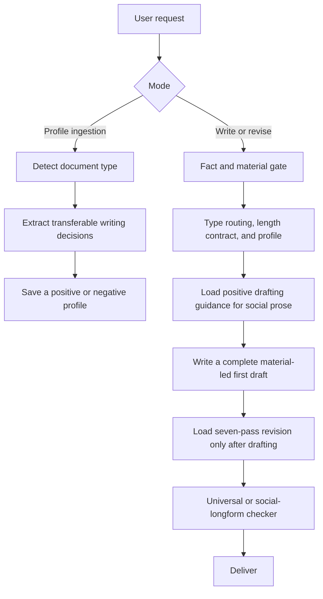

# human-doc-writing

English | [简体中文](README.md)

An open-source Chinese writing skill for Codex. It combines progressive personal writing profiles, scenario-aware document routing, and a universal human-voice quality gate for WeChat articles, Xiaohongshu, Zhihu, blogs, product documentation, tutorials, PRDs, GitHub READMEs, and release notes.

It does not force every document into one generic “human” style. Profiles decide how a specific document should sound and unfold. The universal gate protects shared standards for facts, source material, progression, and natural Chinese.

## What problem it solves

Writing prompts often fall into one of two traps.

- A style-only system may preserve fabricated details, repeated explanations, and model-like phrasing together with the desired voice.
- A universal anti-AI checklist may flatten WeChat essays, PRDs, READMEs, and tutorials into the same tone.

`human-doc-writing` separates those responsibilities.

1. Route the task by what the reader needs to accomplish.
2. Load the current positive and negative profile for that document type.
3. Write from user-provided material and verifiable project facts.
4. Run every draft through the material gate, seven-pass revision, and the appropriate prose checker.

## Origin and attribution

This project incorporates and adapts methods from [KKKKhazix/human-writing](https://github.com/KKKKhazix/human-writing) 1.1.0, using commit `4fda173f3fef7fb808f3eba991eeb2528ea4b189` as the current research baseline.

Adapted areas include the fact and material gate, speaking position, paragraph progression, Chinese sentence order, seven-pass revision, final human-voice review, and parts of the automated prose checker. The upstream project uses the MIT License. Full attribution is retained in [NOTICE.md](NOTICE.md) and [the bundled origin notice](human-doc-writing/references/human-writing-origin.md).

This is an independent derivative project, not the official Khazix skill. It does not imitate the fixed “digital Khazix” persona, catchphrases, or sign-off. It keeps transferable writing methods and adds progressive profiles, document routing, technical-document adaptation, and long-form orchestration.

## Results and two corrections

The integration was initially tested with three matched Chinese prompts covering a GPT-5.6 long-running task, a UI Skills entry-point problem, and a personal writing system.

| Historical version | Mean score across three articles |
|---|---:|
| Standalone `human-writing` | 91.3 |
| Initial integration | 88.3 |
| v1.0 integration | 93.3 |

A later line-by-line reader review exposed a gap in that score. The v1.0 integration inserted self-authored questions followed by immediate answers, standalone “insight” sentences, and unnecessary action metaphors between factual paragraphs. Both checkers passed, yet the first two standalone articles read more naturally because they stated the facts, process, causes, and remedies directly.

Version 1.1 realigns default WeChat nonfiction with the standalone `human-writing` plain-prose baseline. Reader questions stay internal to information ordering; the published prose uses no question marks, and source questions are restated indirectly without changing their meaning; short verdicts that add no fact or explanation are deleted; and a new `wechat-longform` profile blocks self-questioning and performative punchlines.

A second reader review found that version 1.1 had over-corrected. All three drafts had exactly 12 paragraphs, read as safe and orderly product explanations, and missed the brief's approximate 1,200-character target. Useful process and consequence material had been compressed together with the model-like phrasing.

Version 1.2 changes the workflow order. Before drafting, it loads only the fact and material gate plus a positive social-prose guide derived from the standalone skill. Detailed anti-AI revision rules are loaded only after a complete first draft exists. Revision protects speaking position, ordinary judgment, material depth, and irregular rhythm before removing model-shaped prose. The checker adds optional `--min-han`, manual-tone and overly-even-paragraph signals; a separate batch checker detects identical paragraph counts across three or more drafts.

Rechecking all three sample groups with the same current checker produced the following results.

| Sample group | Chinese characters | Body paragraphs | 1,200-character gate | Batch shape |
|---|---|---|---|---|
| Historical standalone | 1204 / 1223 / 1249 | 12 / 13 / 12 | All pass | No shared shape detected |
| Over-corrected v1.1 drafts | 1149 / 1047 / 1167 | 12 / 12 / 12 | All fail | Identical paragraph count detected |
| Revised v1.2 drafts | 1215 / 1213 / 1230 | 11 / 9 / 9 | All pass | No shared shape detected |

On a reread with the original rubric, v1.2 returns to roughly the same overall level as the standalone samples. Some sentences in the first two standalone articles remain looser and more natural. The third v1.2 article is less like a product explanation because it preserves the real failed iteration and the resulting workflow change. That third article includes second-round feedback and is not a strict same-material blind test. This is a regression result for three articles, not a universal superiority claim.

The 93.3 score remains historical evidence from version 1.0, not proof that the integration is better. See [the evaluation notes](docs/evaluation.md) and [revised samples](examples/evaluation/README.md).

## How it works



The skill uses progressive disclosure instead of loading every rule for every task.

- `SKILL.md` holds the modes and top-level workflow.
- `references/type-router.md` routes by reader task.
- `user/portraits/` and `user/anti-patterns/` hold local user preferences.
- `references/types/` supplies defaults only when no personal profile exists.
- `references/material-gate.md` checks facts, source material, and the length contract before drafting.
- `references/natural-social-prose.md` provides positive first-draft guidance for WeChat, Zhihu, blogs, and other long social prose.
- `references/human-voice-gate.md` is loaded only after drafting for shared human-voice revision.
- `scripts/lint_ai_style.py` provides three profiles and an optional minimum-character gate; `scripts/compare_draft_shapes.py` checks a batch for reused paragraph skeletons.

## Use cases

| Scenario | What the skill focuses on |
|---|---|
| WeChat, Zhihu, blogs, and long social posts | Material sufficiency, speaking position, paragraph progression, and endings |
| Xiaohongshu | Immediate value, scan rhythm, concrete actions, and experience boundaries |
| Product docs and white papers | Positioning, capability boundaries, status language, and onboarding path |
| Tutorials and help centers | Executable steps, prerequisites, verification, and troubleshooting |
| PRDs | Decision context, scope, state, acceptance criteria, and non-goals |
| GitHub READMEs and releases | First-screen relevance, shortest install path, compatibility, and upgrade impact |
| Rewriting and de-AI editing | Preserve facts while removing fake specificity, model signposts, and repeated summaries |
| Profile ingestion | Learn structure, rhythm, and editorial choices without storing the source article |

## One-command install

On macOS or Linux:

```bash
curl -fsSL https://raw.githubusercontent.com/AKin-lvyifang/human-doc-writing/main/install.sh | bash
```

The default destination is `${CODEX_HOME:-$HOME/.codex}/skills/human-doc-writing`. The installer never overwrites an existing directory. Review [install.sh](install.sh) first if you prefer an inspect-before-run workflow.

You can also use Codex's bundled installer:

```bash
python3 "${CODEX_HOME:-$HOME/.codex}/skills/.system/skill-installer/scripts/install-skill-from-github.py" \
  --repo AKin-lvyifang/human-doc-writing \
  --path human-doc-writing
```

Deploy to a custom skills directory:

```bash
curl -fsSL https://raw.githubusercontent.com/AKin-lvyifang/human-doc-writing/main/install.sh \
  | bash -s -- --dest "$HOME/.agents/skills"
```

Start a new Codex turn after installation so the skill list refreshes.

## Manual deployment

```bash
git clone --depth 1 https://github.com/AKin-lvyifang/human-doc-writing.git
mkdir -p "${CODEX_HOME:-$HOME/.codex}/skills"
cp -R human-doc-writing/human-doc-writing "${CODEX_HOME:-$HOME/.codex}/skills/human-doc-writing"
```

The skill's scripts use only the Python 3 standard library.

## Usage

### Write from material

```text
$human-doc-writing
Write a Chinese WeChat retrospective from these project notes for product managers using Codex. Preserve factual boundaries and execute directly.
```

### Ingest a positive profile

```text
$human-doc-writing
This is a product document I like. Learn its structure, rhythm, and editorial choices as my product-document profile. Do not copy its facts or sentences.
```

### Record an anti-pattern

```text
$human-doc-writing
I dislike the report-like tone and mechanical conclusion in this article. Save them as anti-patterns for WeChat articles.
```

### Remove model-like writing

```text
$human-doc-writing
Keep the facts and position of this draft, rewrite it as natural Chinese, and remove claims that are unsupported by the material.
```

## Built-in document types

The current router supports explainers, product documents, tutorials, PRDs, GitHub READMEs, GitHub releases, WeChat articles, Xiaohongshu, and other long-form social writing.

The public package ships without anyone's active personal profiles. It uses built-in type cards until the user ingests examples. New profiles are stored under the skill's `user/` directory, which should be preserved during upgrades or migration.

## Templates and examples

- [Profile template](templates/portrait-template.md)
- [Profile example](templates/portrait-example.md)
- [Writing brief template](templates/brief-template.md)
- [Paired evaluation samples](examples/evaluation/README.md)

All published artifacts passed a public-content review. Active personal profiles, profile history, and project-specific source material are excluded.

## Boundaries

- The checker detects textual shapes; it cannot prove that a factual claim is true.
- The skill never fabricates experiences, people, dialogue, or exact scenes to simulate a human writer.
- The social-longform profile removes prompting punctuation, semantic pivoting, and inflated jargon. Colons before direct speech are allowed, and ordinary Chinese patterns such as `不只……还……` are judged by what the sentence is doing rather than blocked literally. The WeChat profile additionally blocks self-authored questions and performative punchlines. Technical documents retain necessary tables, lists, code, and precise terms.
- Profiles store transferable writing decisions, not full source articles, and do not guarantee imitation of a specific author.

## Validation

The public package is checked with skill structure validation, Python syntax checks, an empty-profile-store test, all three lint profiles, WeChat positive and negative fixtures, manual-tone and overly-even-paragraph warnings, minimum-length and batch-shape gates, and a clean [one-command installation smoke test](tests/smoke.sh). See [the evaluation notes](docs/evaluation.md) for evidence and limitations.

## License

[MIT License](LICENSE). See [NOTICE.md](NOTICE.md) for third-party attribution.
